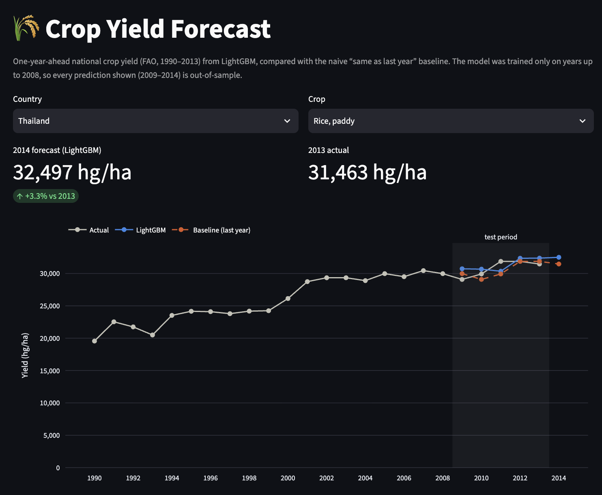

# 🌾 Crop Yield Forecast

Forecasts next year's national crop yield for about 100 countries and 10 crops, and checks honestly whether a LightGBM model beats the "same as last year" baseline on years it has never seen.

**Live demo:** https://crop-yield-forecast-jnrytdwqb3fa8r8vo62xwz.streamlit.app/
<sub>Free tier: if the app is asleep, click the wake-up button; it's back in about 15 seconds.</sub>



**Stack:** pandas · LightGBM · MLflow · FastAPI · Streamlit · Docker · uv · pytest

---

## Results

One-year-ahead forecasts for the **test years 2009–2013** (2,926 country-crop-years). The model was trained only on target years up to 2008.

| Model | MAPE | Median APE | RMSE (log yield) |
|---|---|---|---|
| Baseline: last year's yield | 12.1% | 5.9% | 0.216 |
| **LightGBM** | **11.7%** | **5.5%** | **0.196** |
| Relative change | −2.9% | −6.5% | −9.3% |

**LightGBM beats the baseline, but modestly.** Yields are very persistent (last year alone explains most of this year), so most of the remaining error is weather shocks and reporting noise that no feature in this dataset captures. Beating the baseline by 9% in log RMSE, on future years, is a real but small gain, and I'd rather report that than a flattering number.

<details>
<summary>Per crop (test period)</summary>

| Crop | Rows | MAPE: baseline | MAPE: LightGBM | RMSE (log): baseline | RMSE (log): LightGBM |
|---|---|---|---|---|---|
| Cassava | 205 | 10.7% | 11.2% | 0.190 | 0.181 |
| Maize | 454 | 11.8% | 11.6% | 0.199 | 0.181 |
| Plantains and others | 103 | 8.6% | 8.2% | 0.152 | 0.145 |
| Potatoes | 471 | 8.5% | 7.9% | 0.139 | 0.124 |
| Rice, paddy | 331 | 10.2% | 10.3% | 0.179 | 0.182 |
| Sorghum | 320 | 22.8% | 22.3% | 0.349 | 0.316 |
| Soybeans | 284 | 14.7% | 14.9% | 0.301 | 0.256 |
| Sweet potatoes | 256 | 8.2% | 8.0% | 0.147 | 0.139 |
| Wheat | 401 | 12.6% | 11.2% | 0.203 | 0.175 |
| Yams | 101 | 9.1% | 8.9% | 0.167 | 0.165 |

LightGBM has lower log RMSE on 9 of 10 crops (not rice) and lower MAPE on 7 of 10. Sorghum is the hardest crop for both models.
</details>

### Why a random split would look better than it is

The same model on a random 80/20 split over all years looks better **relative to its baseline**:

| Split | Baseline MAPE → LightGBM | Gain | Baseline RMSE → LightGBM | Gain |
|---|---|---|---|---|
| Time split (reported above) | 12.1% → 11.7% | −2.9% | 0.216 → 0.196 | −9.3% |
| Random 80/20 (leakage demo) | 13.7% → 13.1% | −4.2% | 0.241 → 0.218 | −9.8% |

A random split trains on the future. The model sees later years of the same series and, most likely the bigger effect, other crops from the **same country and year**. A drought year hits every crop in a country, so the model can learn the shock from training rows and then "predict" it on test rows, which it could never do in real use. (The raw random-split errors are higher because its test rows span all years since 1991, which are harder overall: even the baseline's MAPE is 13.7% there vs 12.1% on 2009–13. The fair comparison is the gain over each split's own baseline.)

The inflation here is small because the biggest leak is removed **before** any split. More than half the rows in the Kaggle file are duplicates, with some keys repeated up to 22 times (see below), and a random split on that file would put identical copies of the same country-crop-year in both train and test. **Only the time split is used for reported numbers.**

---

## What I found in the data

Full analysis: [`notebooks/01_eda.ipynb`](notebooks/01_eda.ipynb).

- **More than half the rows are duplicates.** `yield_df.csv` has 28,242 rows but only 13,130 unique (country, crop, year) keys. Yield, rainfall and pesticides are identical within a key; only temperature differs, because the source temperature file has up to 22 weather-station readings per country-year (India). I rebuild the panel from the raw FAO and World Bank files and average temperature per country-year.
- **2003 is missing for every series.** The rainfall file has no 2003 rows, so the original merge dropped that year. The yields still exist in FAO's `yield.csv` (575 of 598 series), and I restore them. That gives a clean panel of **13,711 rows**. Lags are computed by calendar year, never by row position, so a gap gives a missing value instead of a silently wrong one.
- **Coverage is good.** 101 countries, 10 crops, 598 series, and 507 of them are complete. About 20 short series have fewer than 10 years.
- **Yields span four orders of magnitude**, from 50 hg/ha (Tajikistan soybeans) to 500k (potatoes). I model log yield with one global model, so errors are relative and crops share the trend signal.
- **Rainfall is useless as a feature.** Every country has a single value repeated across all years, a climate average rather than weather, so I dropped it. Pesticides are country totals across all crops. Both correlate only weakly with yield.
- **Last year's yield is a very strong predictor.** The log correlation is 0.98 and the naive baseline's MAPE is about 12% on 2009–13, while trends are only about 0–1.5% a year by crop. That's why the model's margin over the baseline is small.

---

## How it works

**Task.** Predict yield in year *t* using only what is known by the end of year *t − 1*.

**Features** (`src/cropyield/features.py`):
- Log-yield lags 1–3, joined by calendar year
- 1- and 2-year growth, and the 3-year mean
- Prior-year pesticides and temperature
- Year, country and crop (as categoricals)

No same-year weather is used.

**Model.**
- LightGBM predicts the **log change from last year's yield**, with an L1 objective. Trees can't extrapolate levels, and L1 isn't thrown off by the few 20× reporting jumps.
- 300 trees with 15 leaves. I chose these settings on a 2005–2008 validation split *inside* the training years; the small grid was flat.
- The 2009–13 test set was used once, for the final numbers.

**Leakage safeguards, each covered by a test in `tests/`:**
- one row per (country, crop, year)
- no test years in the training data
- lags always read the right calendar year
- features never change when future rows change (checked by deliberately injecting a future-leak bug and watching the tests fail)

**Tracking.** `make train` logs three MLflow runs (`baseline`, `lgbm_time_split`, `lgbm_random_split`) with params, overall and per-crop metrics, and the model file.

**Serving.** The Streamlit app, the FastAPI service and the tests all use one `Forecaster` class, which reproduces the evaluation metrics exactly. So the demo shows what was evaluated.

---

## Model card

| | |
|---|---|
| **Model** | LightGBM regressor (`models/model.txt`), L1 objective on the log change in yield |
| **Output** | Next year's national yield (hg/ha) for one country and crop, plus the last-year baseline for comparison |
| **Training data** | Target years 1991–2008 (the first year that has a prior-year yield is 1991) |
| **Evaluation data** | Target years 2009–2013, 2,926 rows, held out entirely from model selection |
| **Metrics** | MAPE 11.7% (baseline 12.1%); median APE 5.5% (5.9%); log RMSE 0.196 (0.216) |

**Intended use.** A portfolio demonstration of honest time-series evaluation. Also useful for exploring how national yields evolve and how hard they are to forecast.

**Not intended for** farm-level or field-level decisions, food-security or policy decisions, commodity trading, or any forecast beyond 2014.

**Limitations:**
- **National and annual only.** It says nothing about regions within a country, fields or seasons.
- **The data ends in 2013.** The app forecasts 2014 from real 2013 lags. The model is the time-split one, trained through 2008, and was not retrained on later years.
- **Weak explanatory features.** Temperature is one annual mean per country, rainfall carries no year-to-year signal, and pesticides are country totals across all crops. The model mostly learns persistence and trend.
- **Reporting artefacts.** A few series jump or crash 10–20× in one year (e.g. Tajikistan soybeans), which look like data issues on tiny harvested areas. These dominate MAPE, which is why median APE and log RMSE are reported too.
- **Uneven accuracy.** Sorghum and soybeans have much larger errors than tubers. Short series have less history to learn from.
- **No uncertainty estimates.** Predictions are point forecasts without intervals.

**Data sources.** FAOSTAT (crop yield and pesticide use) and World Bank climate data (temperature), via the Kaggle dataset listed under Credits.

---

## Run it yourself

**Prerequisites:**
- [uv](https://docs.astral.sh/uv/)
- A Kaggle API token in `~/.kaggle/kaggle.json` (for `make data`)
- On a Mac, `brew install libomp` for LightGBM
- Docker (optional)

```bash
uv sync                          # create .venv from uv.lock
make data && make train && make app   # download data → train + log to MLflow → app on http://localhost:8501
```

| Command | What it does |
|---|---|
| `make eda` | Open the EDA notebook |
| `uv run mlflow ui --backend-store-uri sqlite:///mlflow.db` | Browse the three runs on http://127.0.0.1:5000 |
| `make serve` | FastAPI on http://127.0.0.1:8000/docs |
| `make docker-build && make docker-run` | The API in Docker on http://localhost:8000 |
| `make docker-run-app` | The Streamlit app in Docker on http://localhost:8501 (same image) |
| `uv run ruff check . && uv run pytest` | Lint and tests (20 tests) |

**Example API call:**
```bash
curl -X POST localhost:8000/predict -H 'Content-Type: application/json' \
     -d '{"area": "Thailand", "item": "Rice, paddy", "year": 2014}'
```
It returns the LightGBM prediction, the baseline and the actual yield (null for 2014). An unknown country or crop returns 422.

The app and the API only need the committed `models/model.txt` and `app/data/panel.parquet`, so `make data` and `make train` are optional if you just want to run them.

---

## Project structure

```
src/cropyield/   data.py → features.py → train.py (+ baseline.py, evaluate.py); predict.py serves the model
api/main.py      FastAPI: GET /health, POST /predict
app/             streamlit_app.py, requirements.txt (slim, for Streamlit Cloud), data/panel.parquet
models/          model.txt: the trained LightGBM model
notebooks/       01_eda.ipynb: data findings and modelling decisions
tests/           data, features, splits, API and app tests
```

---

## Credits and license

- **Data:** [FAOSTAT](https://www.fao.org/faostat/) (Food and Agriculture Organization of the United Nations) for crop yield and pesticide use, and the [World Bank](https://data.worldbank.org/) for climate data. Compiled as the [Crop Yield Prediction Dataset](https://www.kaggle.com/datasets/patelris/crop-yield-prediction-dataset) on Kaggle by **patelris**, which Kaggle lists under the World Bank Dataset Terms of Use.
- The raw CSVs are not redistributed; `make data` downloads them. The repo includes only a small derived panel (`app/data/panel.parquet`) that the app needs, with the attribution above.
- **Code:** [MIT License](LICENSE).
